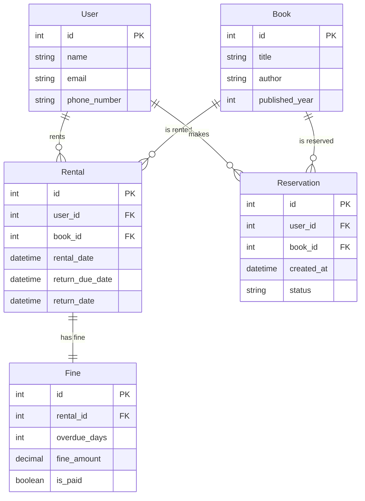

# ERD task

## 도서 대여 시스템

- 비즈니스 명세

  - 사용자는 도서를 대여할 수 있다.
  - 도서는 여러 번 대여될 수 있지만, 한 번에 한 사용자만 대여할 수 있다.
  - 도서는 제목, 저자, 출판년도 등의 정보를 가진다.
  - 사용자는 이름, 이메일, 전화번호 등의 정보를 가진다.
  - 대여 기록에는 대여 날짜, 반납 기한이 포함된다.

- entity, attribute, PK, FK
- entity간 관계, 카디널리티 정의

## 도서 대여 시스템 기능 확장!!

- 비즈니스 명세
  - 도서 예약 시스템
    - 사용자가 원하는 도서가 대출 상태일 경우 예약을 걸어둘 수 있다.
    - 예약자는 예약 취소를 할 수 있다.
  - 연체 및 벌금 관리
    - 대여 기간이 지나도 반납되지 않으면 연체 기록이 남아야 한다.
    - 연체된 경우, 연체 일수에 따라 벌급이 부과된다.
    - 사용자는 벌금을 납부해야만 새로운 도서를 대여할 수 있다.

## ERD

